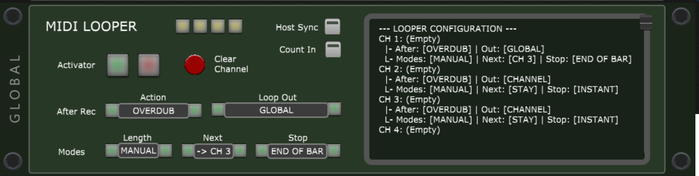
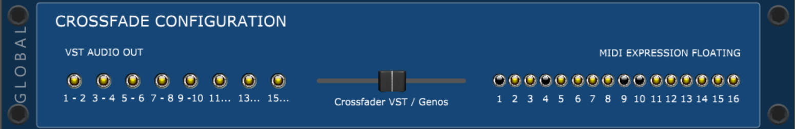

# Gig Performer — Global Rackspace Script

A comprehensive GPScript-based live performance system for [Gig Performer 5](https://gigperformer.com), designed for keyboard players who use arranger workstations (Yamaha Genos) alongside VST instruments.

The Global Rackspace script turns Gig Performer into a full-featured live command center — managing songs, sounds, MIDI routing, looping, and hardware control from a single unified interface.


## Features

### Song Management & Chord Display

Load songs from a setlist, display chord sheets with section markers (Intro, Verse, Chorus...), and navigate through song parts in real time. The timeline tracks your position with bar counters and section cues.


### Preset Configuration & Voice Selection

Browse and swap VST plugins per layer with a publisher/sound/preset hierarchy. Resident layers (1-2) are protected from accidental replacement. The system reads from a `VstDatabase.txt` to offer organized sound browsing by manufacturer.


### Channel Selector & Injection

Select and configure up to 16 MIDI channels individually. The Injection panel controls per-channel parameters: keyboard split, velocity range, fade in/out, MIDI filters, root/transpose, octaver (POG), humanizer, and scale quantizer.


### MIDI Looper

A per-channel MIDI looper with configurable action (Play/Overdub/Mute), loop length, target channel routing, output mode (Channel/Global), and stop behavior (Instant/End of Bar/End of Loop). Supports host sync and count-in.




### Crossfade Configuration

A dual-zone crossfader blending VST audio outputs (up to 16 channels) against MIDI expression for the arranger. Allows smooth transitions between VST layers and arranger sounds during live performance.



### Controller Maps & Scene Morphing

Define named controller maps per song that assign hardware knobs/sliders to VST parameters and MIDI CCs. Includes macro learning, scene morphing with min/max capture, and Smart Adapt for automatic parameter linking.


### Hardware Abstraction Layer (HAL)

All hardware is configured via `DeviceConfig.txt` — no hardcoded MIDI devices in the script. Supports multiple devices with capability flags (transport sync, SysEx, joystick, crossfader targets, feedback). Switch your entire hardware setup by editing one text file.

### SYS-MODE Navigation

A 4-mode system accessible via joystick/sustain pedal:
- **Voice Selector** — browse and load VST sounds
- **Looper Control** — manage MIDI loops per channel  
- **Controller Map** — switch and edit macro assignments
- **Strip-Control** — channel strip parameters

## Requirements

- [Gig Performer 5.x](https://gigperformer.com) (GPScript support required)
- Windows or macOS
- At least one MIDI controller (configured via `DeviceConfig.txt`)
- Optional: Yamaha Genos/Genos2 for arranger integration

## Installation

1. **Clone or download** this repository
2. **Copy example configs** from `examples/` to your Gig Performer user folder:
   - `DeviceConfig.txt` — edit to match your hardware
   - `HardwareMap.txt` — map physical controls to functions
   - `VstDatabase.txt` — register your VST plugins
   - `ControllerMaps.txt` — define controller assignments
   - `GenosMapping.txt` — Genos voice mappings (if applicable)
3. **Open** `examples/Test.gig` in Gig Performer
4. **Paste** the Global Rackspace script (`Global Rackspace V26.gpscript`) into the Global Rackspace script editor
5. **Paste** the Note Prozessor script (`Note Prozessor 7.4.gpscript`) into the corresponding rackspace
6. **Adjust** `UserSnapshotPath` and `UserChordProPath` in Section 1 of the script to match your file locations
7. **Add songs** as `.ini` + `.gpchord` files (see examples: `SlowHip80erDream`, `VSTPlayMode`)

## File Structure

```
├── Global Rackspace V26.gpscript   # Main script (current version)
├── Global Rackspace V25.gpscript   # Previous version
├── Note Prozessor 7.4.gpscript     # Per-rackspace note processing
├── Genos2_Control V2.gpscript      # Genos2 integration script
├── examples/                       # Ready-to-use test data
│   ├── DeviceConfig.txt            # Hardware configuration (INI format)
│   ├── HardwareMap.txt             # Physical control mappings
│   ├── VstDatabase.txt             # VST plugin database
│   ├── ControllerMaps.txt          # Controller map definitions
│   ├── GenosMapping.txt            # Genos voice/program mappings
│   ├── System_Standard.ini         # System default snapshot
│   ├── SlowHip80erDream.ini/.gpchord  # Example song
│   ├── VSTPlayMode.ini/.gpchord       # Example song
│   └── Test.gig                    # Gig Performer test file
├── images/                         # Screenshots of the rackspace UI
└── docs/                           # Design specs and migration notes
```

## Configuration

### DeviceConfig.txt

Define your MIDI devices in INI format with capabilities:

```ini
[Device:Genos]
MidiIn=Genos2 Main
MidiOut=Genos2 Main
Channel=1
Capabilities=TRANSPORT_SYNC, SYSEX_TRIGGER, CROSSFADER_TARGETS, JOYSTICK, MIDI_OUT

[Control:MainFader]
Device=Genos
Type=FADER
CC=7
Feedback=CC
```

### Song Files (.ini)

Each song is a snapshot file with per-channel settings:

```ini
[Snapshot]
Song=MySong.ini
Type=DynamicRef
Global_Crossfade=0.5
ControllerMap=Standard_VST1
```

## License

This project is shared for educational purposes. The GPScript code is original work. Gig Performer is a product of [Deskew Technologies](https://gigperformer.com).
